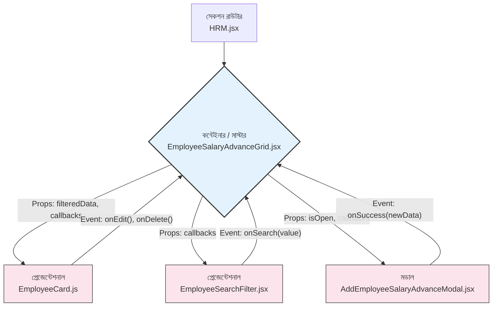

# Standard Operating Procedure (SOP): 新 CRUD মডিউল তৈরি এবং আর্কিটেকচার গাইড

**উদ্দেশ্য:** এই ডকুমেন্টটি আপনার প্রোজেক্টের জন্য একটি স্ট্যান্ডার্ড আর্কিটেকচার এবং নতুন CRUD (Create, Read, Update, Delete) কার্যকারিতা সম্পন্ন মডিউল (যেমন: Inventory, Sales, CRM) তৈরির জন্য একটি ধাপে ধাপে নির্দেশিকা প্রদান করে। এর লক্ষ্য হলো কোডের ধারাবাহিকতা (consistency) বজায় রাখা এবং ডেভেলপমেন্ট প্রক্রিয়াকে দ্রুততর করা।

---

## পার্ট ১: আর্কিটেকচার ওভারভিউ

আপনার অ্যাপ্লিকেশনটি একটি আধুনিক এবং অত্যন্ত কার্যকর ডিজাইন প্যাটার্ন অনুসরণ করে, যা **"Container and Presentational Components"** (বা "Smart and Dumb Components") নামে পরিচিত।

#### আর্কিটেকচারের মূল ভিত্তি:

1.  **সেকশন রাউটার (Section Router):** (যেমন: `HRM.jsx`)
    -   এটি একটি অ্যাপ্লিকেশনের বড় একটি সেকশনের (যেমন: HRM) জন্য একটি নেভিগেশন হাব বা প্রবেশদ্বার হিসেবে কাজ করে।
    -   এর একমাত্র দায়িত্ব হলো সাইডবার বা ট্যাবের মাধ্যমে ব্যবহারকারীর ইনপুট নিয়ে সঠিক **কন্টেইনার কম্পোনেন্ট**-কে রেন্ডার করা।

2.  **কন্টেইনার কম্পোনেন্ট (Container Component):** (যেমন: `EmployeeSalaryAdvanceGrid.jsx`)
    -   এটি মডিউলের **"মস্তিষ্ক" (Brain)**।
    -   সমস্ত ডেটা ফেচিং, স্টেট ম্যানেজমেন্ট (সার্চ, ফিল্টার, লোডিং), এবং প্রধান লজিকগুলো এখানে থাকে।
    -   এটি নিজে ডেটা প্রদর্শন করে না, বরং ডেটা এবং ফাংশনগুলোকে `props` হিসেবে নিচের **প্রেজেন্টেশনাল কম্পোনেন্ট**-গুলোতে পাস করে।

3.  **প্রেজেন্টেশনাল কম্পונেন্ট (Presentational Component):** (যেমন: `EmployeeCard.js`, `EmployeeSearchFilter.jsx`)
    -   এগুলো "ডামি" (Dumb) কম্পোনেন্ট।
    -   এদের নিজস্ব কোনো ডেটা বা লজিক থাকে না। এদের একমাত্র কাজ হলো `props` থেকে পাওয়া ডেটা প্রদর্শন করা এবং ব্যবহারকারীর কোনো অ্যাকশন (যেমন: বাটন ক্লিক) হলে `props` থেকে পাওয়া ফাংশন (Callback) কল করে কন্টেইনারকে জানানো।

#### ডেটা ফ্লো ডায়াগ্রাম:

---

## পার্ট ২: মূল কম্পোনেন্টগুলোর দায়িত্ব

#### ১. `HRM.jsx` (রাউটার)
-   **দায়িত্ব:** HRM সেকশনের সাইডবার নেভিগেশন পরিচালনা করা।
-   **কার্যপ্রণালী:** `activeSection` নামক একটি `useState` ব্যবহার করে কোন মেনু আইটেমটি সক্রিয় আছে তা ট্র্যাক করে। একটি `switch` স্টেটমেন্টের মাধ্যমে এটি সঠিক কন্টেইনার কম্পোনেন্ট (যেমন: `EmployeeSalaryAdvanceGrid`) রেন্ডার করে।

#### ২. `EmployeeSalaryAdvanceGrid.jsx` (কন্টেইনার)
-   **দায়িত্ব:** `Employee` মডিউলের সম্পূর্ণ নিয়ন্ত্রণকারী।
-   **কার্যপ্রণালী:**
    -   **ডেটা আনা:** `useEffect` হুকের মাধ্যমে `employeeAPI.getAll()` কল করে প্রাথমিক ডেটা লোড করে এবং কনটেক্সট থেকে প্রাপ্ত `setUserWith_profile` দিয়ে স্টেট আপডেট করে।
    -   **স্টেট ম্যানেজমেন্ট:** `useState` ব্যবহার করে সার্চ, ফিল্টার, লোডিং এবং মডাল দেখানোর স্টেট পরিচালনা করে।
    -   **লজিক:** `handleEmployeeAdded`, `handleEmployeeUpdated` এর মতো ফাংশনগুলো এখানে ডিফাইন করা থাকে।
    -   **ডেটা পাসিং:** `useMemo` দিয়ে তৈরি করা `filteredEmployees` তালিকাটি `EmployeeCard`-এ `props` হিসেবে পাস করে।

#### ৩. `EmployeeCard.js` (প্রেজেন্টেশনাল)
-   **দায়িত্ব:** একটিমাত্র কর্মচারীর তথ্য প্রদর্শন করা এবং সেই নির্দিষ্ট কর্মচারীর জন্য অ্যাকশন (Edit/Delete) শুরু করা।
-   **কার্যপ্রণালী:**
    -   **সরাসরি API কল:** "Edit" বা "Delete" বাটনে ক্লিক হলে, এটি নিজেই `UpdateEmployeeModal` দেখায় বা `employeeAPI.delete()` কল করে সার্ভারে সরাসরি অ্যাকশন নেয়।
    -   **কন্টেইনারকে অবহিত করা:** অ্যাকশন সফল হলে, এটি `props` থেকে পাওয়া `onEdit()` বা `onDelete()` ফাংশনটিকে কল করে কন্টেইনারকে তালিকা রিফ্রেশ করতে বলে।

#### ৪. `employeeAPI` (API সার্ভিস)
-   **দায়িত্ব:** সমস্ত HTTP রিকোয়েস্টকে একটি গোছানো অবজেক্টের মধ্যে রাখা। এটি কোডকে পরিষ্কার রাখে এবং API এন্ডপয়েন্ট পরিবর্তন করা সহজ করে।

---

## পার্ট ৩: নতুন CRUD মডিউল তৈরির স্ট্যান্ডার্ড পদ্ধতি (SOP)

এখানে "Product" মডিউল তৈরির উদাহরণ দেওয়া হলো।

**ধাপ ১-২: ফাইল এবং ফোল্ডার কপি ও নাম পরিবর্তন**
1.  `src/POS/HRM/EmployeeSalaryAdvanceList` ফোল্ডারটি কপি করে `src/POS/Inventory/`-এর ভেতরে পেস্ট করুন এবং এর নাম দিন **`WarrantyPeriodList`**।
2.  `WarrantyPeriodList` ফোল্ডারের ভেতরের ফাইলগুলোর নামে `Employee`-এর জায়গায় `Product` লিখুন (যেমন: `EmployeeSalaryAdvanceGrid.jsx` → `ProductGrid.jsx`)।

**ধাপ ৩: কোডের ভেতরে Find & Replace**
আপনার কোড এডিটরে `WarrantyPeriodList` ফোল্ডারের ওপর রাইট-ক্লিক করে "Replace in Files" অপশন ব্যবহার করুন এবং নিচের পরিবর্তনগুলো করুন:

| খুঁজুন (Find)         | প্রতিস্থাপন করুন (Replace with) |
| :-------------------- | :------------------------------ |
| `Employee`            | `Product`                       |
| `employee`            | `product`                       |
| `userWith_profile`    | `products`                      |
| `setUserWith_profile` | `setProducts`                   |
| `useUserWithProfile`  | `useProducts`                   |
| `employeeAPI`         | `productAPI`                    |

**ধাপ ৪-৫: নতুন API এবং Context তৈরি**
1.  `employeeAPI`-এর মতো করে একটি `productAPI` অবজেক্ট তৈরি করুন এবং `/api/products/` এন্ডপয়েন্ট ব্যবহার করুন।
2.  `useUserWithProfile`-এর মতো করে একটি `ProductProvider` এবং `useProducts` হুক তৈরি করুন।
3.  `RootProvider.js`-এ `<ProductProvider>` যুক্ত করতে ভুলবেন না।

**ধাপ ৬: UI এবং ফিল্ড কাস্টমাইজেশন**
-   **`ProductCard.js`:** `product.name`, `product.price`, `product.stock` দেখানোর জন্য UI আপডেট করুন।
-   **`AddProductModal.jsx` / `UpdateBrandModal.jsx`:** ফর্মের ইনপুট ফিল্ডগুলো পরিবর্তন করুন।
-   **`PurchaseSearchFilter.jsx`:** ফিল্টারের অপশনগুলো পরিবর্তন করুন (যেমন: "Filter by Category")।
-   **`ProductGrid.jsx`:** ফিল্টারিং লজিক প্রোডাক্টের ফিল্ড অনুযায়ী পরিবর্তন করুন।

**ধাপ ৭: ইন্টিগ্রেশন**
-   আপনার `Inventory.jsx` (বা সমতুল্য) ফাইলে `ProductGrid` কম্পোনেন্টটি `import` করুন এবং `switch` স্টেটমেন্টের সঠিক `case`-এ `<ProductGrid />` রেন্ডার করুন।

---

## পার্ট ৪: প্রফেশনাল টিপস এবং সর্বোত্তম অনুশীলন (Best Practices)

-   **অপটিমিস্টিক আপডেট (Optimistic Updates):** প্রতিটি Delete/Update-এর পর পুরো তালিকা রিফ্রেশ করার পরিবর্তে, UI-তে সরাসরি স্টেট পরিবর্তন করতে পারেন (`setProducts(products.filter(p => p.id !== id))`) এবং যদি API কল ব্যর্থ হয়, তখন পুরনো অবস্থায় ফিরে আসতে পারেন। এটি ব্যবহারকারীকে দ্রুত প্রতিক্রিয়া দেয়।
-   **ত্রুটি ব্যবস্থাপনা (Error Handling):** `console.error` বা `alert` ব্যবহার করার পরিবর্তে, একটি টোস্ট নোটিফিকেশন লাইব্রেরি (যেমন: `react-toastify`) ব্যবহার করুন যাতে ব্যবহারকারীরা সুন্দরভাবে ত্রুটির বার্তা দেখতে পায়।
-   **কেন্দ্রীভূত লজিক:** `EmployeeCard.js`-এ ডিলিট বা আপডেটের লজিক রাখা হয়েছে। বড় অ্যাপ্লিকেশনের ক্ষেত্রে, এই লজিকগুলোকেও কন্টেইনার কম্পোনেন্টে (`ProductGrid`) নিয়ে আসা যেতে পারে, যাতে `ProductCard` সম্পূর্ণ "ডামি" থাকে এবং শুধুমাত্র ইভেন্ট রিপোর্ট করে।

////////////////////////////////////////////////////////////////////////////////////////////////

│ 174   result.sort((a, b) => {                                                                                                                                                   │
│ 175       switch (filters.sortBy) {                                                                                                                                             │
│ 176           case "name_asc":                                                                                                                                                  │
│ 177 -             return a.name.localeCompare(b.name);                                                                                                                          │
│ 177 +             return (a.name || '').localeCompare(b.name || '');                                                                                                            │
│ 178           case "name_desc":                                                                                                                                                 │
│ 179 -             return b.name.localeCompare(a.name);                                                                                                                          │
│ 179 +             return (b.name || '').localeCompare(a.name || '');                                                                                                            │
│ 180           case "date_asc":                                                                                                                                                  │
│ 181               return new Date(a.date_joined) - new Date(b.date_joined);                                                                                                     │
│ 182           case "date_desc": 

│ 174   result.sort((a, b) => {                                                                                                                                                   │
│ 175       switch (filters.sortBy) {                                                                                                                                             │
│ 176           case "name_asc":                                                                                                                                                  │
│ 177 -             return a.name.localeCompare(b.name);                                                                                                                          │
│ 177 +             return (a.name || '').localeCompare(b.name || '');                                                                                                            │
│ 178           case "name_desc":                                                                                                                                                 │
│ 179 -             return b.name.localeCompare(a.name);                                                                                                                          │
│ 179 +             return (b.name || '').localeCompare(a.name || '');                                                                                                            │
│ 180           case "date_asc":                                                                                                                                                  │
│ 181               return new Date(a.date_joined) - new Date(b.date_joined);                                                                                                     │
│ 182           case "date_desc":  